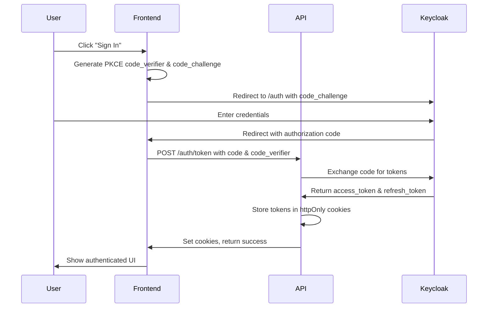

# Authentication Guide

## Overview

Angry Birdman uses **Keycloak** as its identity provider, implementing OAuth 2.0
and OpenID Connect (OIDC) standards for authentication. The API uses a **backend
token proxy pattern** to securely manage tokens in httpOnly cookies, protecting
against XSS attacks.

## Authentication Flow

### 1. OAuth2 Authorization Code Flow with PKCE

This is the primary authentication method for web applications.



#### Step-by-Step Process

**Step 1: Generate PKCE Parameters**

```javascript
// Frontend code
import { generateCodeVerifier, generateCodeChallenge } from '@/utils/pkce';

const codeVerifier = generateCodeVerifier();
const codeChallenge = await generateCodeChallenge(codeVerifier);

// Store verifier for later use
sessionStorage.setItem('code_verifier', codeVerifier);
```

**Step 2: Redirect to Keycloak**

```javascript
const keycloakUrl = 'http://localhost:8080';
const realm = 'angrybirdman';
const clientId = 'angrybirdman-frontend';
const redirectUri = 'http://localhost:5173/auth/callback';

const authUrl =
  `${keycloakUrl}/realms/${realm}/protocol/openid-connect/auth?` +
  `client_id=${clientId}&` +
  `redirect_uri=${encodeURIComponent(redirectUri)}&` +
  `response_type=code&` +
  `scope=openid profile email&` +
  `code_challenge=${codeChallenge}&` +
  `code_challenge_method=S256`;

window.location.href = authUrl;
```

**Step 3: Handle Callback**

```javascript
// In your callback route handler
const urlParams = new URLSearchParams(window.location.search);
const code = urlParams.get('code');
const codeVerifier = sessionStorage.getItem('code_verifier');

// Exchange code for tokens via backend
const response = await fetch('/auth/token', {
  method: 'POST',
  headers: { 'Content-Type': 'application/json' },
  credentials: 'include', // Important: Include cookies
  body: JSON.stringify({
    code,
    codeVerifier,
    redirectUri: 'http://localhost:5173/auth/callback',
  }),
});

if (response.ok) {
  // Tokens are now stored in httpOnly cookies
  // Redirect to main app
  window.location.href = '/';
}
```

### 2. Password Grant (Direct Login)

Used for automatic login after registration. **Not recommended for general
use** - use OAuth2 flow instead.

```javascript
const response = await fetch('/auth/login-with-password', {
  method: 'POST',
  headers: { 'Content-Type': 'application/json' },
  credentials: 'include',
  body: JSON.stringify({
    username: 'user123',
    password: 'SecurePassword123!',
  }),
});
```

## Token Management

### Token Storage

Tokens are stored in **httpOnly cookies** by the backend:

- `access_token`: Short-lived (15 minutes)
- `refresh_token`: Long-lived (30 days)

**Why httpOnly cookies?**

- JavaScript cannot access them (XSS protection)
- Automatically included in requests
- Secure flag in production (HTTPS only)
- SameSite protection against CSRF

### Token Refresh

The API automatically refreshes expired access tokens using the refresh token.
No frontend action required.

```javascript
// Tokens are refreshed automatically on API calls
// If refresh token expires, user must re-authenticate
const response = await fetch('/api/clans/1/roster', {
  credentials: 'include', // Cookies sent automatically
});
```

### Token Validation

**Backend Token Validation (Production)**:

```javascript
// API validates JWT signature using Keycloak's public keys
const jwksClient = jwksRsa({
  jwksUri: `${KEYCLOAK_URL}/realms/${REALM}/protocol/openid-connect/certs`,
});

// Verify token signature and claims
const decoded = jwt.verify(token, getKey, {
  algorithms: ['RS256'],
  issuer: `${KEYCLOAK_URL}/realms/${REALM}`,
  audience: 'account',
});
```

## Making Authenticated Requests

### Frontend (JavaScript/TypeScript)

```javascript
// Always include credentials for cookie-based auth
const response = await fetch('/api/clans/1/roster', {
  method: 'GET',
  credentials: 'include', // Critical: Include cookies
  headers: {
    'Content-Type': 'application/json',
  },
});

if (response.status === 401) {
  // Unauthorized - redirect to login
  window.location.href = '/login';
}
```

### Using Fetch Wrapper

```javascript
// Create a wrapper for authenticated requests
async function authenticatedFetch(url, options = {}) {
  const response = await fetch(url, {
    ...options,
    credentials: 'include',
    headers: {
      'Content-Type': 'application/json',
      ...options.headers,
    },
  });

  if (response.status === 401) {
    // Token expired or invalid - redirect to login
    window.location.href = '/login';
    throw new Error('Authentication required');
  }

  return response;
}

// Usage
const data = await authenticatedFetch('/api/clans/1/battles').then((r) =>
  r.json()
);
```

### Using Axios

```javascript
import axios from 'axios';

const api = axios.create({
  baseURL: 'http://localhost:3001',
  withCredentials: true, // Include cookies
  headers: {
    'Content-Type': 'application/json',
  },
});

// Add response interceptor for error handling
api.interceptors.response.use(
  (response) => response,
  (error) => {
    if (error.response?.status === 401) {
      window.location.href = '/login';
    }
    return Promise.reject(error);
  }
);

// Usage
const { data } = await api.get('/api/clans/1/roster');
```

## Checking Authentication Status

```javascript
const response = await fetch('/auth/status', {
  credentials: 'include',
});

const { authenticated } = await response.json();

if (!authenticated) {
  // User not logged in
  window.location.href = '/login';
}
```

## Getting Current User Information

```javascript
const response = await fetch('/auth/user', {
  credentials: 'include',
});

if (response.ok) {
  const user = await response.json();
  // {
  //   sub: "keycloak:uuid",
  //   preferred_username: "john_doe",
  //   email: "john@example.com",
  //   clanId: 1,
  //   clanName: "Angry Flyers",
  //   owner: false,
  //   roles: ["clan-admin"]
  // }
}
```

## Logout

```javascript
const response = await fetch('/auth/logout', {
  method: 'POST',
  credentials: 'include',
});

if (response.ok) {
  // Tokens cleared, redirect to home
  window.location.href = '/';
}
```

## Authorization (Role-Based Access Control)

### User Roles

1. **user**: Default role for all authenticated users
2. **clan-admin**: Can manage roster and battles for their clan
3. **clan-owner**: Full control over their clan, can manage admins
4. **superadmin**: System-wide administration

### Checking Permissions

The API automatically checks permissions based on JWT claims:

```javascript
// Frontend: Check user roles
const response = await fetch('/auth/user', { credentials: 'include' });
const user = await response.json();

if (user.roles.includes('clan-owner')) {
  // Show owner-only features
}

if (user.roles.includes('superadmin')) {
  // Show superadmin dashboard
}
```

### Role Requirements by Endpoint

**Public (No Authentication)**:

- `GET /api/clans` - Browse clans
- `GET /api/clans/:id/battles` - View battles
- `GET /api/clans/:id/roster` - View roster
- `GET /api/clans/:id/stats/*` - View statistics

**Authenticated (user role)**:

- `POST /api/users/register-clan` - Register new clan
- `GET /auth/user` - Get own profile
- `POST /api/admin-requests` - Request admin access

**Clan Admin (clan-admin role)**:

- `POST /api/clans/:id/roster` - Add players
- `POST /api/clans/:id/battles` - Record battles
- `PUT /api/clans/:id/roster/:playerId` - Update players

**Clan Owner (clan-owner role)**:

- `PUT /api/clans/:id` - Update clan profile
- `POST /api/clans/:id/admins` - Promote admins
- `DELETE /api/clans/:id/admins/:userId` - Remove admins

**Superadmin (superadmin role)**:

- `GET /api/admin/users` - Manage all users
- `GET /api/admin/audit-logs` - View all audit logs
- `POST /api/action-codes` - Manage action codes

## JWT Token Structure

### Access Token Claims

```json
{
  "iss": "http://localhost:8080/realms/angrybirdman",
  "sub": "uuid-from-keycloak",
  "preferred_username": "john_doe",
  "email": "john@example.com",
  "name": "John Doe",
  "given_name": "John",
  "family_name": "Doe",
  "realm_access": {
    "roles": ["clan-admin", "user"]
  },
  "clanId": 1,
  "exp": 1703001234,
  "iat": 1703000334
}
```

### Custom Claims

- `clanId`: The clan associated with the user (custom client scope)

## Security Best Practices

### Frontend

1. **Never store tokens in localStorage or sessionStorage** - Use httpOnly
   cookies
2. **Always use `credentials: 'include'`** in fetch requests
3. **Handle 401 responses** by redirecting to login
4. **Validate user roles** before showing protected UI elements
5. **Use HTTPS in production** to prevent man-in-the-middle attacks

### Backend

1. **Validate JWT signatures** using Keycloak's public keys
2. **Check token expiration** on every request
3. **Verify required claims** (issuer, audience, roles)
4. **Use SameSite cookies** to prevent CSRF attacks
5. **Implement rate limiting** on authentication endpoints

## Troubleshooting

### "401 Unauthorized" on API Requests

**Causes**:

- Token expired (access token lifetime: 15 min)
- Invalid token signature
- User account disabled
- Missing credentials in request

**Solutions**:

- Ensure `credentials: 'include'` in fetch options
- Check browser console for cookie presence
- Try logging in again
- Verify Keycloak is running and accessible

### "403 Forbidden" on Protected Endpoints

**Causes**:

- Insufficient permissions (wrong role)
- Trying to access another clan's resources
- Account not associated with any clan

**Solutions**:

- Check user roles via `/auth/user`
- Verify clan ID matches user's clanId
- Request admin access if needed

### CORS Errors in Browser

**Causes**:

- Frontend origin not in CORS_ORIGIN env var
- Missing credentials in request
- Preflight request failing

**Solutions**:

- Add origin to API's CORS_ORIGIN configuration
- Include `credentials: 'include'`
- Check browser dev tools network tab for preflight

### Keycloak Connection Issues

**Causes**:

- Keycloak container not running
- Wrong KEYCLOAK_URL in environment
- Network connectivity issues

**Solutions**:

```bash
# Check Keycloak is running
docker ps | grep keycloak

# Verify Keycloak URL
curl http://localhost:8080/realms/angrybirdman/.well-known/openid-configuration

# Check API environment variables
cat api/.env | grep KEYCLOAK
```

## Testing Authentication

### Manual Testing with cURL

```bash
# 1. Obtain access token (using password grant for testing)
curl -X POST http://localhost:3001/auth/login-with-password \
  -H "Content-Type: application/json" \
  -d '{"username":"testuser","password":"testpass"}' \
  -c cookies.txt

# 2. Make authenticated request
curl -X GET http://localhost:3001/api/clans/1/roster \
  -b cookies.txt

# 3. Logout
curl -X POST http://localhost:3001/auth/logout \
  -b cookies.txt
```

### Automated Testing

See test examples in `api/tests/routes/auth.test.ts` for integration testing
patterns.

## Related Documentation

- [API Overview](./API-OVERVIEW.md)
- [Getting Started](./GETTING-STARTED.md)
- [Integration Examples](./INTEGRATION-EXAMPLES.md)
- [Keycloak Configuration](../../keycloak/README.md)
